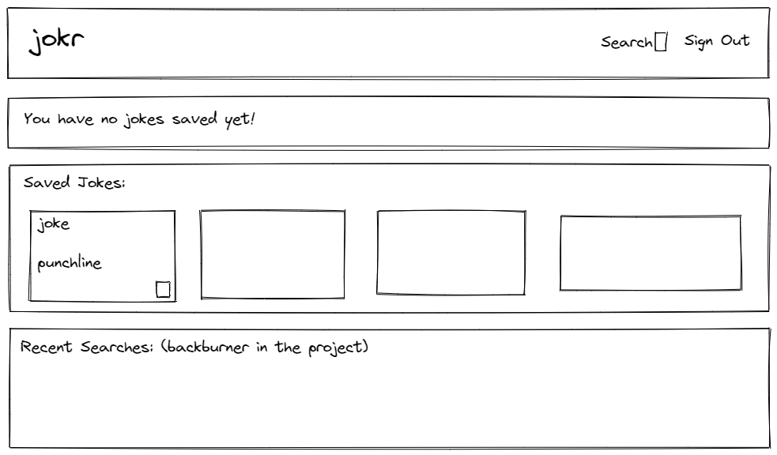
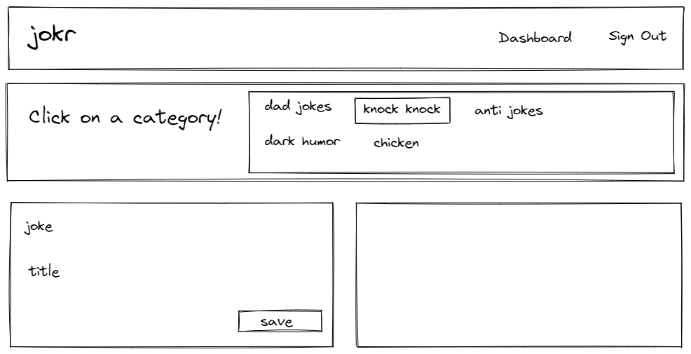

# jokr

## mock ups

* Login Page
* 

* Dashboard
* 

* Search Page
* 

## user story

```
AS a user
I WANT to be able to login if I am a returning user or be able to register if I am a first-time user
SO I can search for new or saved jokes to impress my family and friends.

GIVEN I want to search for or remember a joke
WHEN I login to jokr
THEN I search for jokes by category
WHEN I search for a joke
THEN search results display in an easy-to-read way on the page
WHEN I see a joke I want to save
THEN I can click the "save" button and the joke is saved
WHEN I want to view my saved jokes
THEN I can click the "dashboard" link to see my personalized list
WHEN I want to delete a joke from my saved jokes list
THEN I can click the "delete" button and delete the joke
WHEN I want to go back to searching for jokes
THEN I can click the "search" link and be brought back to the search page