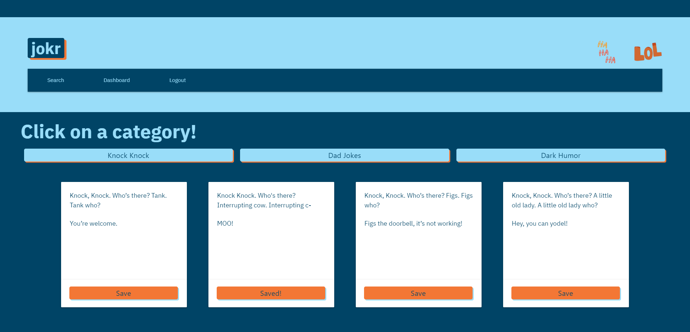

# jokr
 Jokr: The Funniest Wesbite You'll See Today!

## Overview/Description
Welcome to Jokr website. explains the skills and knowledge to build a web application from scratch. With our team, we have conceived and executed a design that solves a real-world problem by integrating data received from multiple server-side API requests. Working collaboratively, we have created agile development methodologies and implementations that are shown throughout our git branch workflow and pull requests. Jokr is a website of a user interface of a community revolved around jokes. A user will be able to login and signup, go to a search page, click a cateogory then save their own joke. This user will be able to recieve feedback from other users in the website community. This allows users to see other different varities of humor and improve their own humor with a community of jokers.

## Pitch
Have you ever been in a situation where you had a great joke to tell, but couldn’t remember the setup? Or maybe, you heard a joke, wanted to tell one too, but couldn’t remember any! Jokr is the site for you! Keep a list of your favorite jokes to tell your friends and family, or look up new jokes for later.


## Technologies Used:
* CSS
* SQL
* Javscript
* JSON
* Node.js
* Express.js
* Handlebars.js
* Materialize

## Heroku and GitHub links
* [Heroku Link](https://damp-bastion-89209.herokuapp.com/)
* [GitHub Link](https://github.com/dolcebasstrombone/jokr)

## Screenshot:


## User Story
```
AS an everyday user looking for humor
I WANT the ability to search for anytype of joke by specific category
SO I can save them for later to show my friends and family.
I WANT to be able to login if I am a returning user or be able to register if I am a first-time user
SO I can see my favorites list atany time.

GIVEN I want to search for or remember a joke
WHEN I login to jokr
THEN I search for jokes by category
WHEN I search for a joke
THEN search results display in an easy-to-read way on the page
WHEN I see a joke I want to save
THEN I can click the "save" button and the joke is saved
WHEN I want to view my saved jokes
THEN I can click the "dashboard" link to see my personalized list
WHEN I want to delete a joke from my saved jokes list
THEN I can click the "delete" button and delete the joke
WHEN I want to go back to searching for jokes
THEN I can click the "search" link and be brought back to the search page
```

## Contributors
- Josie Franklin https://github.com/dolcebasstrombone
- Chip Hill https://github.com/roo116
- Namitha V Kamath https://github.com/nkamth
- Veronica Person https://github.com/veronicaperson
- Thomas Woods https://github.com/thomaswoods25

## License & Copyright
© Josie Franklin, Chip Hill, Namitha V Kamath, Veronica Person, Thomas Woods Universtiy at North Carolina Chapel Hill Coding Bootcamp